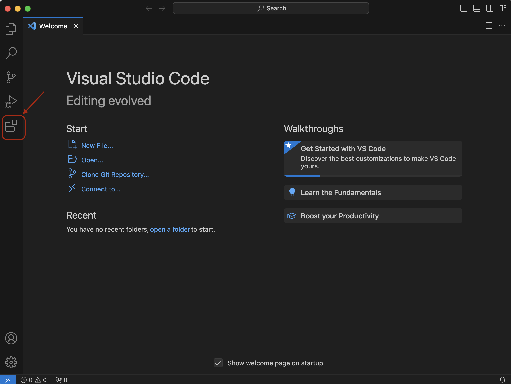
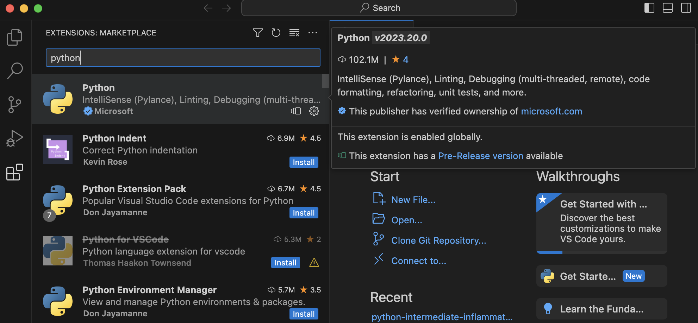
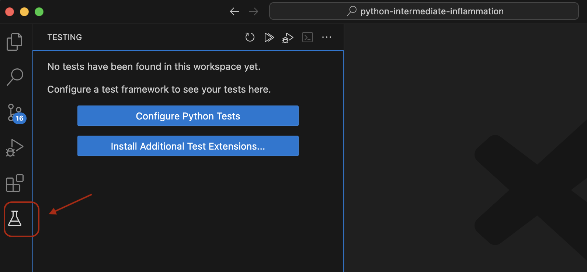

[Visual Studio Code (VS Code)](https://code.visualstudio.com/), not to be confused with [Visual Studio](https://visualstudio.microsoft.com/), 
is an Integrated Development Environment (IDE) by Microsoft. You can use it as your IDE for this course 
instead of PyCharm - bellow are some instructions to help you set up.

## Installation

You can download VS Code from the [VS Code project website](https://code.visualstudio.com/download).

### Extensions

VS Code can be used to develop code in many programming languages, provided the appropriate extensions have been installed.
For this course we will require the extensions for Python. To install extensions click the icon highlighted below 
in the VS Code sidebar:

{: .image-with-shadow width="800px" }

In the search box, type "python" and select the Intellisense Python extension by Microsoft, 
then click the "Install" button to install the extension. You may be asked to reload the VS Code IDE for the changes 
to take effect.

{: .image-with-shadow width="800px" }

## Using the VS Code IDE

Let's open our software project in VS Code and familiarise ourselves with some commonly used features needed for this course.

### Opening a Software Project

Select `File` > `Open Folder` from the top-level menu and navigate to the directory where you saved the 
[`python-intermediate-inflammation` project](../11-software-project/index.html#downloading-our-software-project),
which we are using in this course.

### Configuring a Virtual Environment in VS Code

As in the episode on
[virtual environments for software development]({{ page.root }}),
we'd want to create a virtual environment for our project to work in (unless you have already done so earlier in the course).
From the top menu, select `Terminal` > `New Terminal` to open a new terminal (command line) session within the project directory,
and run the following command to create a new environment:

~~~
python3 -m venv venv
~~~
{: .language-bash}

This will create a new folder called `venv` within your project root.
VS Code will notice the new environment and ask if you want to use it as the default Python interpreter for this project - 
click "Yes".

---

#### Troubleshooting Setting the Interpreter

If the prompt did not appear, you can manually set the interpreter.

1. Navigate to the location of the `python` binary within the virtual environment
using the file browser sidebar (see below). The binary will be located in `<virtual environment directory>/bin/python` within the project directory.
2. Right-click on the binary and select `Copy Path`.
3. Use the keyboard shortcut `CTRL-SHIFT-P` to bring up the command palette, then search for `Python: Select Interpreter`.
4. Click `Enter interpreter path...`, paste the path you copied followed by Enter.

---

You can verify the setup has worked correctly by selecting an existing Python script in the project folder (or creating a blank
new one, if you do not have it, by right-clicking on the file explorer sidebar, selecting `New File` and creating a new file 
with the extension `.py`).

If everything is setup correctly, when you select a Python file in the file explorer you should see
the interpreter and virtual environment stated in the information bar at the bottom of VS Code, e.g., 
something similar to the following:

Any terminal you now open will start with the activated virtual environment.

### Adding Dependencies

For this course you will need to install `pytest`, `numpy` and `matplotlib`. Start a new terminal and run the 
following:

~~~
pip install numpy matplotlib pytest
~~~
{: .language-bash}

---

#### Troubleshooting Dependencies

If you are having issues with `pip`, it may be that `pip` version you have is too old.
Pip will usually inform you via a warning if a newer version is available. 
You can upgrade pip by running the following from the terminal:

~~~
pip install --upgrade pip
~~~
{: .language-bash}

You can now try to install the packages again.

---

## Running Python Scripts in VS Code

To run a Python script in VS Code, open the script by clicking on it,
and then either click the Play icon in the top right corner,
or use the keyboard shortcut `CTRL-ALT-N`.

{: .image-with-shadow width="800px" }

## Adding a Linter in VS Code

In [the episode on coding style]({{ page.root }})
and [the subsequent episode on linters]({{ page.root }}),
you are asked to use an automatic feature in PyCharm
that picks up linting issues with the source code.
Because it is language agnostic, VS Code does not have a linter for Python built into it.
Instead, you will need to install an extension to get linting hints.
Get to the "Extensions" side pane by one of these actions:

1. Bring up the command palette with `CTRL-SHFT-P`, search for `View: Show Extensions`
2. Use the direct keyboard shortcut `CTRL-SHFT-X`
3. Click on the ["Extensions" icon](./index.html#extensions) on the left side panel we used previously. 
   
In the Extensions panel, type "pylint" into the search bar. Select Pylint from the result panel 
that comes up and then the `Install` button:

{: .image-with-shadow width="800px" }

Once installed, Pylint warnings about your code should automatically populate the "Problems" panel
at the bottom of VS Code window, as shown below. You can also bring up the "Problems" panel using the keyboard shortcut `CTRL-SHFT-M`.

{: .image-with-shadow width="800px" }

There are other Python linters available, such as [Flake8](https://flake8.pycqa.org/en/latest/), 
and Python code formatters, such as [Black](https://pypi.org/project/black/).
All are available as extensions that can be installed in a similar manner from the "Extensions" panel.

We also recommend that you install these linters and formatters in your virtual environment,
since then you will be able to run them from the terminal as well.
For example, if you want `pylint` and `black` packages, execute the following from the terminal:

~~~bash
$ pip3 install pylint black
~~~

They will now both be available to run as command line applications,
and you will find the details of how to run `pylint` in the lesson material (`black` in not covered).

## Running Tests

VS Code also allows you to run tests from a dedicated test viewer.
Clicking the "laboratory flask" button in the sidebar allows you to set up test exploration:

{: .image-with-shadow width="800px" }

Click `Configure Python Tests`,
select `pytest` as the test framework,
and the `tests` directory as the directory for searching.

You should now be able to run tests individually
using the test browser (available from the top level menu `View` > `Testing`) and selecting the test of interest.

{: .image-with-shadow width="800px" }

### Running Code in Debug Mode

When clicking on a test you will see two icons,
the ordinary Run/Play icon, and a Run/Play icon with a bug.
The latter allows you to run the tests in debug mode
useful for obtaining further information as to why a failure has occurred - this will be covered in the main lesson material.
