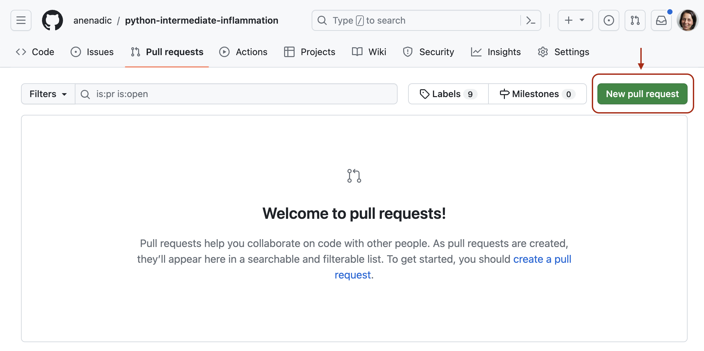
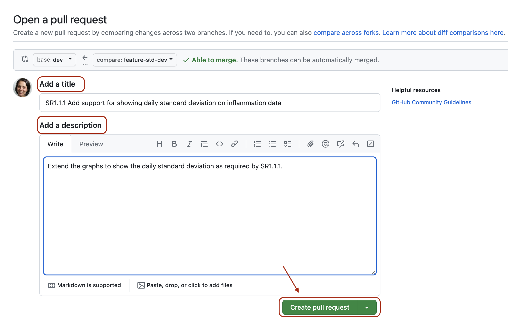
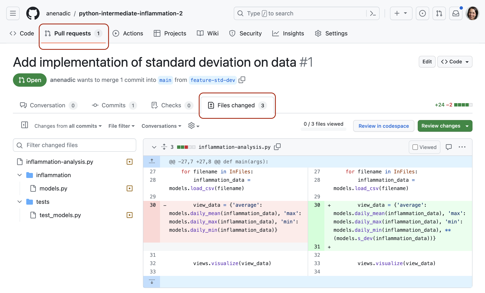
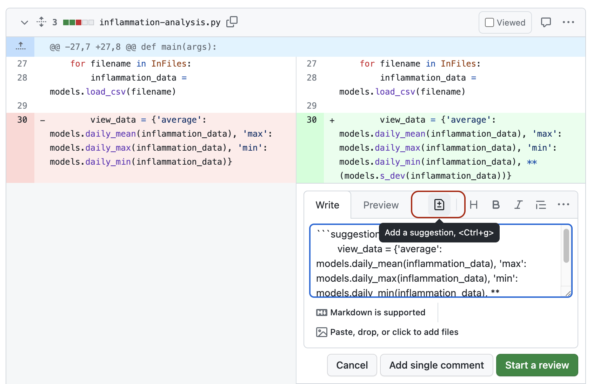
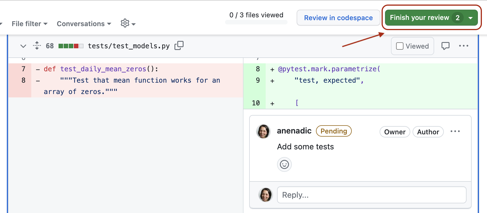
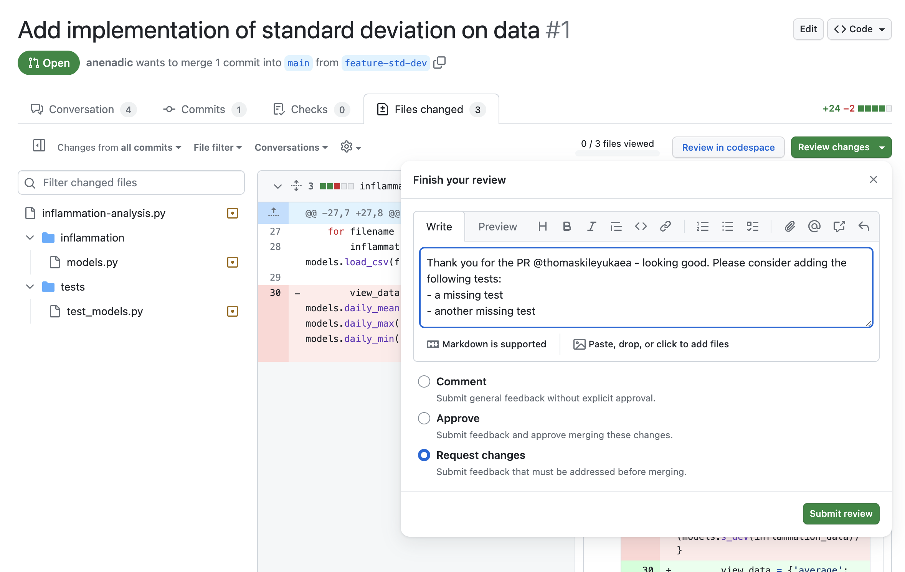
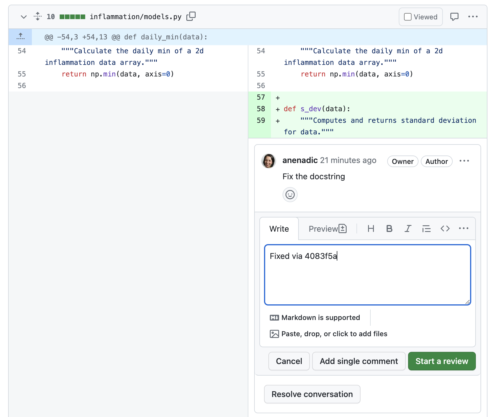

## Introduction

So far in this course we’ve focused on learning software design
and (some) technical practices, tools and infrastructure that
help the development of software in a team environment, but in an individual setting.
Despite developing tests to check our code - no one else from the team had a look at our code
before we merged it into the main development stream.
Software is often designed and built as part of a team,
so in this episode we'll be looking at how to manage the process of team software development
and improve our code by engaging in code review process with other team members.

## Collaborative Code Development Models
The way a team provides contributions to a shared codebase depends on
the type of development model used in a project.
Two commonly used models are described below.

### Fork and Pull Model
In the **fork and pull** model, anyone can **fork** an existing repository 
(to create their copy of the project linked to the source)
and push changes to their personal fork.
A contributor can work independently on their own fork as they do not need
permissions on the source repository to push modifications to a fork they own.
The changes from contributors can then be **pulled** into the source repository
by the project maintainer on request and after a code review process.
This model is popular with open source projects as it
reduces the start up costs for new contributors
and allows them to work independently without upfront coordination
with source project maintainers.
So, for example, you may use this model when you are an external collaborator on a project
rather than a core team member.

### Shared Repository Model

In the **shared repository model**, collaborators are granted push access to a single shared code repository.
By default, collaborators have write access to the main branch.
However, it is best practice to create feature branches for new developments,
and protect the main branch. See the [extra episode on protecting the main branch](../protect-main-branch)
on how to do this.
While it requires more upfront coordination, it is easier to share each others
work, so it works well for more stable teams.
This model is more prevalent with teams and organisations collaborating on private projects.

## Code Review

Regardless of the collaborative code development model you and your collaborators use, 
[code reviews][code-review] are one of the widely accepted best practices for software development in teams
and something you should adopt in your development process too. 

Code review is a software quality assurance practice
where one or several people from the team (different from the code's author)
check the software by viewing parts of its source code when code changes are introduced. 
It is one of the most useful team code development practices -
someone checks your design or code for errors and gets to learn from your solution; 
having to explain code to someone else clarifies
your rationale and design decisions in your mind too. 

Code review is universally applicable throughout the software development cycle -
from design to development to maintenance.
According to Michael Fagan, the author of the
[code inspection technique](https://en.wikipedia.org/wiki/Fagan_inspection),
rigorous inspections can remove 60-90% of errors from the code
even before the first tests are run ([Fagan, 1976](https://doi.org/10.1147%2Fsj.153.0182)).
Furthermore, according to Fagan,
the cost to remedy a defect in the early (design) stage is 10 to 100 times less compared to
fixing the same defect in the development and maintenance stages, respectively.
Since the cost of bug fixes grows in orders of magnitude throughout the software lifecycle,
it is far more efficient to find and fix defects
as close as possible to the point where they were introduced.

There are several **code review techniques** with various degree of formality
and the use of a technical infrastructure, including:

 - [Over-the-shoulder code review](https://about.gitlab.com/topics/version-control/what-is-code-review/#Over-the-shoulder%20reviews) -
     one developer talks the other developer through the code changes whilst sat at the same machine.
 - [Pair programming](https://about.gitlab.com/topics/version-control/what-is-code-review/#Pair%20programming) -
     two developers work on the code at the same time where one of them actively codes whereas the other provides real-time feedback.
 - [Formal code inspection](https://en.wikipedia.org/wiki/Fagan_inspection) -
     up to 6 partipants go through a formalised process to inspect the code specifications or design for defects.
 - [Tool assisted code review](https://about.gitlab.com/topics/version-control/what-is-code-review/#Tool-assisted%20reviews) -
     developers use tools such as GitHub to review the code independently and give feedback.

You can read more about these techniques in the ["Five Types of Review" section](https://www.khoury.northeastern.edu/home/lieber/courses/cs4500/f07/lectures/code-review-types.pdf) of the ["Best Kept Secrets of Peer Code Review" eBook](https://www.yumpu.com/en/document/view/19324443/best-kept-secrets-of-peer-code-review-pdf-smartbear).

It is worth trying multiple code review techniques to see what works
best for you and your team.
We will have a look at the **tool-assisted code review process**, which is likely to be the most effective and efficient.
We will use GitHub's built-in code review tool - **pull requests**, or PRs.
It is a lightweight tool, included with GitHub's core service for free
and has gained popularity within the software development community in recent years.

## Code Reviews via GitHub's Pull Requests

Pull requests are fundamental to how teams review and improve code
on GitHub (and similar code sharing platforms) -
they let you tell others about changes you've pushed to a branch in a repository on GitHub
and that your code is ready for review.
Once a pull request is opened,
you can discuss and review the potential changes with others on the team
and add follow-up commits based on the feedback
before your changes are merged into the development branch.
The name 'pull request' suggests you are **requesting** the codebase moderators
to **pull** your changes into the codebase.

Such changes are normally done on a feature branch,
to ensure that they are separate and self-contained,
that the main branch only contains "production-ready" work,
and that the `develop` branch contains code that has already been extensively tested.
You create a branch for your work based on one of the existing branches
(typically the `develop` branch but can be any other branch),
do some commits on that branch,
and, once you are ready to merge your changes,
create a pull request to bring the changes back to the branch that you started from.
In this context, the branch from which you branched off to do your work
and where the changes should be applied back to
is called the **base branch**,
while the feature branch that contains changes you would like to be applied is the **compare branch**.

How you create your feature branches and open pull requests in GitHub will depend on
your collaborative code development model:

- In the fork and pull model,
  where you do not have write permissions to the source repository,
  you need to fork the repository first
  before you create a feature branch (in your fork) to base your pull request on.
- In the shared repository model,
  in order to create a feature branch and open a pull request based on it
  you must have write access to the source repository or,
  for organisation-owned repositories,
  you must be a member of the organisation that owns the repository.
  Once you have access to the repository,
  you proceed to create a feature branch on that repository directly.

In both development models,
it is recommended to create a feature branch for your work and the subsequent pull request,
even though you can submit pull requests from any branch or commit.
This is because, with a feature branch,
you can push follow-up commits as a response to feedback
and update your proposed changes within a self-contained bundle.
The only difference in creating a pull request between the two models is
how you create the feature branch.
In either model, once you are ready to merge your changes in -
you will need to specify the base branch and the compare branch.

Let's see this in action -
you are going to act as a reviewer on a change to the codebase raised by a
fictional colleague on one of your fellow learner's repository.
Once this is done, you will then take on the role of the fictional colleague
and respond to the review on your repository.
If you are completing this course by yourself, you can raise the review on
your own repository, review it there and finally respond to your own review
comments. This is actually a very sensible thing to do in general - looking
at your own code in a review window will allow you to spot mistakes you
have not seen before.

Here is an outline of the process of a tool-assisted code review.


```mermaid
%% Must disable useMaxWidth to have the diagram centre
%%{init: { 'sequence': {'useMaxWidth':false} } }%%
sequenceDiagram
    participant A as Author
    participant R as Reviewer
    A->>A: Write some code
    A->>R: Raise a pull request
    R->>R: Add comments to a review
    R->>A: Submit a review
    loop Until approved
        A->>R: Address or respond to review comments
        R->>A: Clarify or resolve comments
    end
    R->>A: Approve pull request
    A->>A: Merge pull request
```
Generated with Mermaid tool, diagram available at: https://mermaid.live/edit#pako:eNptUrtuwzAM_BVCgOEl_QEPAYx29eKgyOKFsZhYgF6VKLeBkX-vXDvNo5UWSXfHI0VOoneSRCWKApoUGaSKeNAEKVKDX3sleQB2MOBIwANlHE8BDfRkOVBni2JSVnEFE5SRPhLZnsp8K-8ClNURdaQL5F0Unb3y3pZYnYW8PAZWvfJoGWrACHXiwYW_YDuDLY2KPmmF65fttq5gHxQTRGcI5qpuWFtBiyoSIPikNYQ5gcgLoV0ItZRZZUyuK84VY2bNHjdSdtilg1H8hGnnPLxbVhrQ--BGkgtwZ5-jB4oRXMjS6J2Vs8cS5df2plrtXjUGdTyvKqdHeuKSlQ_51Yv_P1WuX9RQOD3CYiMMBYNK5imYZnIncqMNdaLKR0lHTJo70dlLpmJitzvbXlQcEm1E8hL52sjrI0nFLjTLYP3M1-Ub_pDLrQ

{: .image-with-shadow width="600px"}

Recall [solution requirements SR1.1.1](../31-software-requirements/index.html#solution-requirements)
from an earlier episode.
Your fictional colleague has implemented it according to the specification
and pushed it to a branch `feature-std-dev`.
You will turn this branch into a pull request for your fictional colleague on your
repository.
You will then engage in code review for the change (acting as a code reviewer) on
a fellow learner's repository.
Once complete, you will respond to the comments from another team member on the pull request 
on your repository (acting as a code author).

### Raising a Pull Request

1. Head over to your software repository in GitHub.
2. Navigate to the pull requests tab.
3. Create a new pull request by clicking the green `New pull request` button.
   {: .image-with-shadow width="900px"}
4. Select the base and the compare branch, e.g. `main` and `feature-std-dev`, respectively.
   Recall that the base branch is where you want your changes to be merged
   and the compare branch contains the changes.
5. Click `Create pull request` button to open the request.
   {: .image-with-shadow width="900px"}
6. Add a comment describing the nature of the changes,
   and then submit the pull request by clicking the `Create pull request` button (in the new window).
{: .image-with-shadow width="900px"}
7. At this point, the code review process is initiated.

We will now discuss what to look for in a code review,
before practising it on this fictional change.

### Reviewing a Pull Request

Once a review has been raised it is over to the reviewer to review the code
and submit feedback.

Reviewing code effectively takes practice.
However, here is some guidance on what you should
be looking for when reviewing a piece of code.

#### Things to Look for in a Code Review

Start by understanding what the code _should_ do, by reading the specification/user requirements,
the pull request description and talking to the developer.
In this case, understand what [SR1.1.1](../31-software-requirements/index.html#solution-requirements) means.

Once you're happy, start reading the code (skip the test code for now - we will come back to it later). 
You're going to be assessing the code in the following key areas.

##### Is the proposed code readable?

* Think about the names of the variables, do they [follow guidelines for good
names?](../15-coding-conventions/index.html#l#naming-conventions)
* Do you understand what conditions in each if statements are for?
* Do the function names match the behavior of the function?

##### Is the proposed code a minimal change?

* Does the code reimplement anything that already exists, either
elsewhere in the codebase or in a library you know about?
* Does the code implement something that isn't on the ticket?

##### Is the structure of the code clear?

* Do functions do just one thing?
* Is the code using the right level of modularity?
* Is the code consistent with the structure of the rest of the code?

##### Is there an appropriate and up-to-date documentation for the proposed code?

* If functionality has changed, has corresponding documentation been
updated?
* If new functions have been added, do they have appropriate
levels of documentation?
* Does the documentation make sense?
* Are there clear and useful comments that explain complex designs
and focus on the "why/because" rather than the "what/how"?

#### Things Not to Look for in a Code Review

The overriding priority for reviewing code should be making sure progress is being made -
don't let perfect be the enemy of the good here.
According to [“Best Kept Secrets of Peer Code Review” (Cohen, 2006)](https://www.amazon.co.uk/Best-Kept-Secrets-Peer-Review/dp/1599160676)
the first hour of reviewing code is the most effective, with diminishing returns after that.

To that end, here are a few things you *shouldn't* be trying to spot when reviewing:
* Linting issues, or anything else that an automated tool can spot - get the Continuous Integration (CI) to do it.
* Bugs - instead make sure there are tests for all cases.
* Issues that pre-date the change - raise separate PRs fixing these issues separately to avoid heading down a rabbit hole.
* Architecture re-writes - try to have design discussions upfront, 
or else have a meeting to decide whether the code needs to be rewritten.

#### Adding a review comment

1. We will start by having your course mate adding you as a collaborator on their repository. 
They can do that from 
the `Settings` tab of the repository, then `Collaborators and teams` tab on the left, 
then clicking the `Add people` button. 
Once they find you by your GitHub name - you will receive an invitation via email to join the 
repository as a collaborator. 
You will have to do the same for the collaborator doing the review on your repository.
    > ## Code Review from External Contributors
    > You do not have to be a collaborator on a public repository to do code reviews 
    > so this step is not strictly necessary. 
    > We are still asking you to do it now as we will get you working in teams
    > for the rest of the course so it may make sense to start setting up your collaborators now.
    {: .callout}
{: .image-with-shadow width="900px"}
2. Open up the pull request from the GitHub's `Pull Requests` tab on the home page 
of your course mate's software repository, then head to the `Files changed` tab.
{: .image-with-shadow width="900px"}
3. When you find a line that you want to add a comment to, click on the blue
plus (+) button next to the line. This will bring up a "Write" box to add your comment.
{: .image-with-shadow width="800px"}
You can also add comments referring to multiple lines by clicking the plus and
dragging down over the relevant lines.
If you want to make a concrete suggestion or a change to the code directly, 
such as renaming a variable, you can click the `Add a suggestion` button 
(which looks like a document with a plus and a minus in it).
This will populate the comment with the existing code, and you can edit it to be
what you think the code should be.
{: .image-with-shadow width="800px"} 
GitHub will then provide a button for the code author to apply your change directly.
4. Write your comment in the box, and then click `Start review`.
This will save your comment, but not publish it yet.
You can use `Add single comment` button to immediately post a comment.
However, it is best to batch the comments into a single review, so that the author
knows when you have finished adding comments
(and avoid spamming their email with notifications).
5. Continue adding comments in this way, if you have any, using the `Add review comment` button.
on subsequent comments.

> ## Effective Review Comments
>
> * Make sure your review comments are specific and actionable.
> * Try to be as specific as you can - instead of "this code is unclear"
> instead say "I don't understand what values this variable can hold".
> * Make it clear in the comment if you want something to change as part
> of this pull request.
> * Ideally provide a concrete suggestion (e.g., better variable name).
{: .callout}

> ## Exercise: Review Some Code
>
> Pair up with a colleague from your group/team and go to the pull request your colleague created on their 
> project repository.
> If there is an odd number of people in your group, three people can go in a round robin fashion
> (the first team member will review the pull request on the second member’s repository
> and will receive comments on the pull request on their repository from
> the third team member).
> If you are going through the material on your own and do not have a collaborator,
> you can be the reviewer on the pull requests on your own repository.
>
> Review the code, looking for the kinds of problems that we have just discussed.
> There are examples of all four main problem areas in the pull request,
> so try to make at least one suggestion for each area.
>
> Do not submit your review just yet.
>
>> ## Solution
>>
>> Here are some of the things you might have found were wrong with the code. 
>> ##### Is the proposed code readable? 
>> * Unclear function name `s_dev` - uses an uncommon abbreviation increasing mental load
>>    when reading code that calls this function, prefer `standard_deviation`.
>> * Variable `number` not clear what it contains --- prefer business-logic name like `mean` or `mean_of_data`
>>
>> ##### Is the proposed code a minimal change?
>>
>> * Could have used `np.std` to compute standard deviation of data without having to reimplement
>>   from scratch.
>>
>> ##### Is the structure of the proposed code clear?
>> * Have the function return the data, rather than having the graph name (a view layer consideration)
>>   leak into the model code.
>>
>> ##### Is there an appropriate and up-to-date documentation for the proposed code?
>>
>> * The documentation say it returns the standard deviation, but it actually returns a dictionary containing
>>    the standard deviation.
> {: .solution}
{: .challenge}

#### Making Sure Code is Valid

The other key thing you want to verify in a code review is that the code is correct and
well tested.
One approach to do this is to build up a list of tests you expect to see
(and the results you'd expect them to have),
and then verify that all these tests are present and correct.

Start by listing out all the tests you'd expect to see based on the specification.

As you are going through the code, add to this list with any tests you can think
of, making sure to add tests for:

* All paths through the code.
* Making each `if` statement be evaluated as `True` and `False`.
* Executing loops with empty, single and multi-element sequences.
* Edge cases that you spot.
* Any circumstances where you are not certain how code would behave.

Once you have built the list, go through the tests in the pull request. Make sure
the tests test what you expect (so inspect them closely!).

### Submitting a Review

Once you have a list of tests you want the author to add, it is time to
submit your review.

1. To do this, click the `Finish your review` button at the top of the `Files changed` tab.
{: .image-with-shadow width="800px"}
In the comment box, you can add any comments that aren't
associated with a specific line.
For example, you can put the list of tests that you want to see
added here.
2. Next you will need select to one of `Comment`, `Approve` or `Request changes`.
{: .image-with-shadow width="900px"}
* Use `Approve` if you would be happy for the code to
go in with no further changes.
* Use `Request changes` to communicate to the author that
they should address your comments before you will approve it.
* Use `Comment` if you don't want to express a decision on
whether the code should be accepted. For example, if you've been asked
to look at a specific part of the code, or if you are part way through
a review, but wanted to share some comments sooner.
3. Finally, you can press `Submit review` button.
This will publish all the comments you've made as part of the review and
let the author know that the review is complete and it is their
turn for action.

> ## Exercise: Review the Code for Suitable Tests
>
> Remind yourself of the specification of SR1.1.1 and write a list of
> tests you'd expect to see for this feature.
> Review the code again and expand this list to include any other
> edge cases the code makes you think of.
> Go through the tests in the pull request and work out which tests are present.
>
> Once you are happy, you can submit your review.
> Select `Request changes` to let the author know they need to address your comments.
>
>> ## Solution
>>
>> Your list might include the following:
>>
>> 1. Standard deviation for one patient with multiple observations.
>> 2. Standard deviation for two patients.
>> 3. Graph includes a standard deviation graph.
>> 4. Standard deviation function should raise an error if given empty data.
>> 5. Computing standard deviation where deviation is different from variance.
>> 6. Standard deviation function should give correct result given negative inputs.
>> 7. Function should work with numpy arrays.
>>
>> Looking at the tests in the PR, you might be content that tests for 1, 4 and 7 are present
>> so you would request changes to add tests 2, 3, 5 and 6.
>>
>> In looking at the tests, you may have noticed that the test for numpy arrays is currently
>> spuriously passing as it does not use the return value from the function in the assert.
>>
>> You may have spotted that the function actually computes the variance rather than
>> the standard deviation. Perhaps that made you think to add the test
>> for some data where the variance and standard deviation are different.
>> In more complex examples, it is often easier to spot code that looks like it could be wrong
>> and think of a test that will exercise it. This saves embarrassment if the code turns out
>> to be right, means you have the missing test written if it is wrong, and is often quicker
>> than trying to execute the code in your head to find out if it is correct.
>>
> {: .solution}
{: .challenge}

### Responding to Review Comments

When you receive comments on your code,
there are a few different things that can happen.

1. You understand and agree with what the reviewer is saying.
With such a review, you should make the change to your code on your branch (or accept the 
suggested change by the reviewer).
Once you've made the change you can commit it.
It might be helpful to add a thumbs up reaction to the comment, so the reviewer knows
you have addressed it. Even better, leave a comment such as "Fixed via #commit_number" with a link 
to your commit that implemented the change.
{: .image-with-shadow width="800px"}
{: .image-with-shadow width="800px"}
2. Some comment may not make total sense to you or it is not clear 
what the change should be - you should reply to such comments to ask for clarification.
3. You disagree or are really lost on what the reviewer is driving at with their comments.
In this case, it might be best to talk to them in person. 
Discussions that happen on code reviews can often feel quite adversarial -
discussing what the best solution is in person can often defuse this.

> ## Exercise: Responding to Comments
>
> Look at the pull request that you created on your repository. 
> By now you should now have someone else's comments on it.
> For each comment, either reply explaining why you don't think the change is necessary
> or make the change and push a commit fixing it. You can reply to the comment indicating you
> have done it.
>
> At the same time, people will be addressing your comments on a pull request in their repository. 
> If you're happy that your comment has been suitably addressed, you can mark it as resolved.
> Once you're happy they have all been addressed, you can approve the pull request.
> To approve a pull request, submit a new review and this time select `Approve`.
> This tells the author you are happy for them to merge the pull request.
{: .challenge}

### Approving a Pull Request

1. Once the reviewer approves the changes, the person whose repository it is can
   merge the changes onto the base branch.
   Typically, it is the code author's responsibility to merge
   but this may differ from team to team.
   In our case, you will merge the changes on the PR on your repository.
   {: .image-with-shadow width="800px"}
2. Delete the merged branch to reduce the clutter in the repository.

## Writing Easy-To-Review Code

There are a few things you can do to make it
as easy as possible for the reviewer to review your code:

* Keep the changes **small**.
* Keep each commit as **one logical change**.
* Provide a **clear description** of the change.
* **Review your code yourself**, before requesting a review.

The most important thing to keep in mind is how long your pull request is.
Smaller changes, that just make one small improvement, will be much quicker and easier to
review.
There is no golden rule, but [studies into code review](https://smartbear.com/resources/ebooks/the-state-of-code-review-2020-report/) show that you should not review more
than 400 lines of code at a time, so this is a reasonable target to aim for.
You can refer to some [studies](https://jserd.springeropen.com/articles/10.1186/s40411-018-0058-0)
and [Google recommendations](https://google.github.io/eng-practices/review/developer/small-cls.html)
as to what a "large pull request" is but be aware that it is not an exact science.

Even within a single review, try to keep each commit to be making one logical change.
This can help if your review would otherwise be too large.
In particular, if you've reformatted, refactored and changed the behavior of the
code make sure each of these is in a separate commit
(i.e reformat the code, commit, refactor the code, commit, alter the behavior of the code, commit).

Make sure you write a clear description of the content and purpose of the change.
This should be provided as the pull request description.
This should provide the context needed to read the code.

It is also a good idea to review your code yourself,
before requesting a review.
In doing this you will spot the more obvious issues with your code,
allowing your reviewer to focus on the  things you cannot spot.

## Writing Effective Review Comments

Code is written by humans (mostly!), and code review is a form of communication.
As such, empathy is important for effective reviewing.

When reviewing code, it can be sometimes frustrating when code is confusing, particularly
as it will be implemented differently to how you would have done it.
However, it is important as a reviewer to be compassionate to the
person whose code you are reviewing.
Specifically:

* Identify positives in code as and when you find them (particularly if it is an improvement on
  something you've previously fed back on in a previous review).
* Remember different doesn't mean better - only request changes if the code is wrong or hard to understand.
* Only provide a few non-critical suggestions - you are aiming for better rather than perfect.
* Ask questions to understand why something has been done a certain way rather than assuming you
  know a better way.
* If a conversation is taking place on a review and hasn't been resolved by a
  single back-and-forth exchange, then schedule a conversation to discuss instead
  (recording the results of the discussion in the PR).

## Defining a Review Process For Your Team

To be effective, code review needs to be a process that is followed by everyone
developing the code.
Everyone should believe that the process provides value.
One way to foster this is to agree on the review process as a team and consider, e.g.:

* Do all changes need to go through code review
* What technologies will you use to manage the review process
* How quickly do you expect someone to review the code once you've raised a PR?
* How long should be spent reviewing code?
* What kind of issues are (and aren't) appropriate to raise in a PR?
* How will someone know when they are expected to take action (e.g. review a PR)?

You could also consider using pull request states in GitHub:
 - Open a pull request in a `DRAFT` state to show progress or request early feedback,
 - `READY FOR REVIEW` when you are ready for feedback,
 - `CHANGES REQUESTED` to let the author know
     they need to fix the requested changes or discuss more,
 - `APPROVED` to let the author they can merge their pull request.

Once you've introduced a review process, you should monitor (either formally or
informally) how well it is working.

It is important that reviews are processed quickly, to avoid costly context switching.
We recommend aiming for 3 hours to get a first review, with the PR being merged the same
day in most cases. If you are regularly missing these targets, then you should review
where things are getting stuck and work out what you can do to move things along.

> ## Exercise: Code Review in Your Own Working Environment
>
> In this episode we have looked at why and how to use a tool driven code review process
> using GitHub pull requests. We've also looked at some best practices for doing
> code reviews in general.
>
> Now think about how you typically develop code.
> What benefits do you think you would see for introducing a code review process in
> your work environment.
> How you might institute code review practices within your environment.
> Write down a process for a tool assisted code review, answering the questions
> above.
>
> Once complete, discuss with the rest of the class what are the advantages of
> a code review process and
> what challenges you think you'd face in implementing this process in your own working environment.
> > ## Solution
> > The purposes of code review include:
> > - improving internal code readability, understandability, quality and maintainability,
> > - checking for coding standards compliance, code uniformity and consistency,
> > - checking for test coverage and detecting bugs and code defects early,
> > - detecting performance problems and identifying code optimisation points,
> > - finding alternative/better solutions,
> > - sharing knowledge of the code, and of coding standards and expectations of quality.
> >
> > Finally, it helps increase the sense of collective code ownership and responsibility,
> > which in turn helps increase the "bus factor"
> > and reduce the risk resulting from information and capabilities
> > being held by a single person "responsible" for a certain part of the codebase
> > and not being shared among team members.
> >
> > Challenges you might face introducing a code review process:
> > - complaints that it is a waste of time,
> > - creating a negative atmosphere where people are overly critical of each others work, 
> > or are defensive of their own,
> > - perfectionism leading to slower development,
> > - people not sharing code to avoid the review process.
> >
> > Make sure to monitor whether these are happening, and adjust the process accordingly.
> {: .solution}
{: .challenge}

## Further Reading

There are multiple perspectives to a code review process -
from general practices to technical details relating to different roles involved in the process.
We have discussed the main points, but do check these useful code review blogs from [
Swarmia](https://www.swarmia.com/blog/a-complete-guide-to-code-reviews/?utm_term=code%20review&utm_campaign=Code+review+best+practices&utm_source=adwords&utm_medium=ppc&hsa_acc=6644081770&hsa_cam=14940336179&hsa_grp=131344939434&hsa_ad=552679672005&hsa_src=g&hsa_tgt=kwd-17740433&hsa_kw=code%20review&hsa_mt=b&hsa_net=adwords&hsa_ver=3&gclid=Cj0KCQiAw9qOBhC-ARIsAG-rdn7_nhMMyE7aeSzosRRqZ52vafBOyMrpL4Ypru0PHWK4Rl8QLIhkeA0aAsxqEALw_wcB)
and [Smartbear](https://smartbear.com/learn/code-review/best-practices-for-peer-code-review/).

The key thing is to try it, and iterate the process until it works well for your team.


